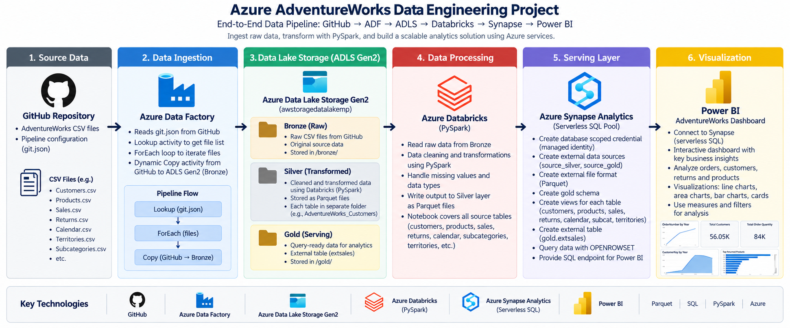

# Azure AdventureWorks End-to-End Data Engineering Project

An end-to-end Azure data engineering project built on the AdventureWorks dataset using **Azure Data Factory, Azure Data Lake Storage Gen2, Azure Databricks, PySpark, Azure Synapse Analytics, and Power BI**.

The project implements a metadata-driven ingestion pipeline, Bronze/Silver/Gold-style data layers, PySpark-based transformations, Synapse Serverless SQL serving objects, and a Power BI dashboard for analytics.

## Architecture



### End-to-End Flow

```text
GitHub AdventureWorks CSV files
        ↓
Azure Data Factory
Lookup → ForEach → Dynamic Copy
        ↓
ADLS Gen2 Bronze
Raw CSV files
        ↓
Azure Databricks / PySpark
Cleaning + transformations
        ↓
ADLS Gen2 Silver
Parquet files
        ↓
Azure Synapse Analytics
Serverless SQL + OPENROWSET
Gold schema views / external table
        ↓
Power BI
Interactive analytics dashboard
```

## Project Highlights

- Built a **metadata-driven Azure Data Factory pipeline** using `Lookup`, `ForEach`, and a dynamic `Copy` activity.
- Used `git.json` to parameterize source URLs, sink folders, and sink filenames instead of hardcoding separate copy activities.
- Stored raw source files in an **ADLS Gen2 Bronze layer**.
- Used **Azure Databricks + PySpark** to read Bronze CSV data, apply transformations, and write transformed output to the Silver layer in **Parquet** format.
- Queried Silver Parquet data through **Azure Synapse Serverless SQL** using `OPENROWSET`.
- Created a **Gold schema**, SQL views, external data sources, an external Parquet file format, and an external sales table.
- Connected the Synapse serving layer to **Power BI** for business reporting and visualization.
- Built a Power BI dashboard covering orders, customers, order quantity, and returned products.

## Technology Stack

| Layer | Technology |
|---|---|
| Source | GitHub, AdventureWorks CSV files |
| Orchestration | Azure Data Factory |
| Data Lake | Azure Data Lake Storage Gen2 |
| Processing | Azure Databricks, Apache Spark, PySpark |
| Storage Format | CSV, Parquet |
| Serving | Azure Synapse Analytics Serverless SQL |
| SQL | T-SQL, `OPENROWSET`, views, external tables |
| Visualization | Power BI |
| Authentication | Managed Identity, OAuth / Service Principal concepts |

## Repository Structure

```text
azure-adventureworks-data-engineering/
│
├── README.md
├── .gitignore
│
├── architecture/
│   └── azure_data_engineering_architecture.png
│
├── adf/
│   ├── arm-template/
│   │   ├── ARMTemplateForFactory.json
│   │   ├── ARMTemplateParametersForFactory.json
│   │   ├── factory/
│   │   └── linkedTemplates/
│   └── screenshots/
│
├── config/
│   └── git.json
│
├── databricks/
│   └── silver_layer.ipynb
│
├── synapse/
│   └── sql/
│       ├── 01_create_gold_schema.sql
│       ├── 02_create_external_resources.sql
│       ├── 03_create_gold_views.sql
│       ├── 04_create_external_sales_table.sql
│       └── 05_validation_queries.sql
│
└── powerbi/
    ├── AdventureWorks_Azure_Dashboard.pbix
    └── dashboard_preview.pdf
```

## 1. Data Ingestion with Azure Data Factory

The ingestion layer uses a dynamic ADF pipeline to copy AdventureWorks CSV files from GitHub into the Bronze layer of ADLS Gen2.

The metadata file `config/git.json` contains three parameters for each source file:

```json
{
  "p_rel_url": "source-relative-path",
  "p_sink_folder": "destination-folder",
  "p_sink_file": "destination-file.csv"
}
```

The ADF flow is:

```text
LookupGit
   ↓
ForEachGit
   ↓
DynamicCopy
   ↓
ADLS Bronze
```

This allows one reusable Copy activity to ingest multiple datasets instead of creating a separate Copy activity for every file.

The metadata currently includes AdventureWorks datasets for:

- Product Categories
- Calendar
- Customers
- Product Subcategories
- Products
- Returns
- Sales 2015
- Sales 2016
- Sales 2017
- Territories

## 2. Bronze Layer — ADLS Gen2

The Bronze layer contains the raw CSV data ingested from GitHub.

Example layout:

```text
bronze/
├── AdventureWorks_Calendar/
├── AdventureWorks_Customers/
├── AdventureWorks_Product_Categories/
├── AdventureWorks_Products/
├── AdventureWorks_Returns/
├── AdventureWorks_Sales_2015/
├── AdventureWorks_Sales_2016/
├── AdventureWorks_Sales_2017/
├── AdventureWorks_Territories/
└── Product_Subcategories/
```

The Bronze layer preserves the source data before transformation.

## 3. Silver Layer — Azure Databricks + PySpark

The Databricks notebook reads Bronze CSV data directly from ADLS Gen2 using `abfss://` paths.

The notebook processes:

- Calendar
- Customers
- Product Categories
- Products
- Returns
- Sales
- Territories
- Product Subcategories

The three annual sales folders are read together using a wildcard path.

### PySpark Operations Used

Examples of transformations in the notebook include:

- `withColumn`
- `concat_ws`
- `split`
- `month`
- `year`
- `to_timestamp`
- `regexp_replace`
- `groupBy`
- `agg`
- `count`
- derived columns
- data type transformations

The transformed datasets are written to the Silver layer as **Parquet** files.

### Authentication

The public notebook should not contain hard-coded Azure credentials.

The GitHub-safe notebook uses a Databricks Secret Scope pattern:

```python
tenant_id = dbutils.secrets.get(scope="azure-adls", key="tenant-id")
client_id = dbutils.secrets.get(scope="azure-adls", key="client-id")
client_secret = dbutils.secrets.get(scope="azure-adls", key="client-secret")
```

Create the appropriate secret scope and secret keys before running the notebook in another environment.

## 4. Synapse Serving Layer

Azure Synapse Analytics uses the **Built-in Serverless SQL Pool** to expose transformed Silver data for analytics.

The SQL implementation includes:

- Gold schema creation
- Database-scoped credential using Managed Identity
- External data source for Silver
- External data source for Gold
- External Parquet file format
- Gold views over Silver Parquet data
- External sales table
- Validation queries

### Gold Views

The following views are created:

```text
gold.calendar
gold.customers
gold.products
gold.returns
gold.sales
gold.subcat
gold.territories
```

Most Gold objects are SQL views over Silver Parquet files using `OPENROWSET`.

Example:

```sql
CREATE OR ALTER VIEW gold.products
AS
SELECT *
FROM OPENROWSET(
    BULK 'https://awstoragedatalakemp.dfs.core.windows.net/silver/AdventureWorks_Products/',
    FORMAT = 'PARQUET'
) AS Q;
GO
```

The project also creates:

```text
gold.extsales
```

as an external table backed by the Gold storage location.

## 5. Power BI Dashboard

The final serving layer is connected to Power BI for reporting.

The dashboard includes:

- Order count by year
- Total customers / customer records
- Customer activity by year
- Total order quantity
- Top returned products

Preview:

[View dashboard preview](powerbi/dashboard_preview.pdf)

The PBIX file is included in:

```text
powerbi/AdventureWorks_Azure_Dashboard.pbix
```

## Security Notes

Before publishing an Azure project to GitHub:

- Do not commit client secrets
- Do not commit SAS tokens
- Do not commit storage account keys
- Do not commit passwords
- Do not commit private connection strings

Use Databricks Secret Scopes, Azure Key Vault, Managed Identity, or environment-specific configuration instead.

## How to Reproduce

1. Create an Azure resource group.
2. Create an ADLS Gen2 storage account.
3. Create the following containers:
   - `bronze`
   - `silver`
   - `gold`
   - `parameters`
4. Create an Azure Data Factory instance.
5. Deploy or recreate the ADF ingestion pipeline.
6. Upload `config/git.json` to the `parameters` container.
7. Run the dynamic ingestion pipeline to populate Bronze.
8. Create an Azure Databricks workspace.
9. Configure ADLS authentication securely.
10. Run `databricks/silver_layer.ipynb`.
11. Create an Azure Synapse workspace.
12. Run the scripts in `synapse/sql/` in numerical order.
13. Connect Power BI to the Synapse Serverless SQL endpoint.
14. Open or refresh `powerbi/AdventureWorks_Azure_Dashboard.pbix`.

## Skills Demonstrated

- Azure Data Factory
- Metadata-driven pipeline design
- Dynamic Copy activities
- Lookup and ForEach activities
- Azure Data Lake Storage Gen2
- Medallion-style data architecture
- Azure Databricks
- Apache Spark
- PySpark DataFrame API
- CSV to Parquet processing
- Azure Synapse Analytics
- Serverless SQL
- T-SQL
- `OPENROWSET`
- External data sources
- External file formats
- SQL views
- External tables / CETAS pattern
- Managed Identity
- Power BI
- End-to-end cloud data pipeline design

## Acknowledgments

This project was built as a hands-on implementation based on the Azure end-to-end data engineering tutorial by **Ansh Lamba** using the AdventureWorks dataset.

The implementation was recreated in my own Azure environment and extended with my own Power BI reporting layer and project documentation.

## Author

**Malay Patel**

Computer Science Co-op Student  
Wilfrid Laurier University
