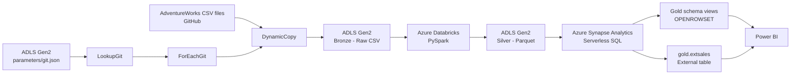
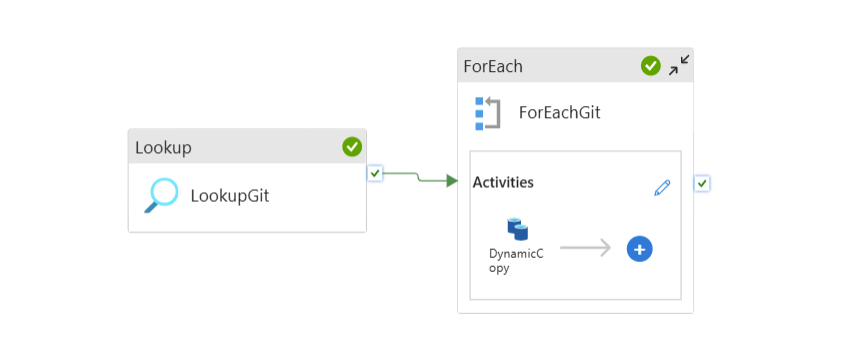
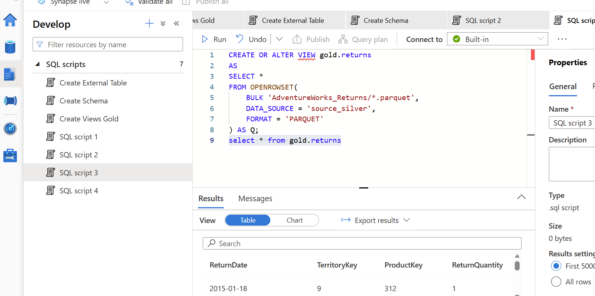
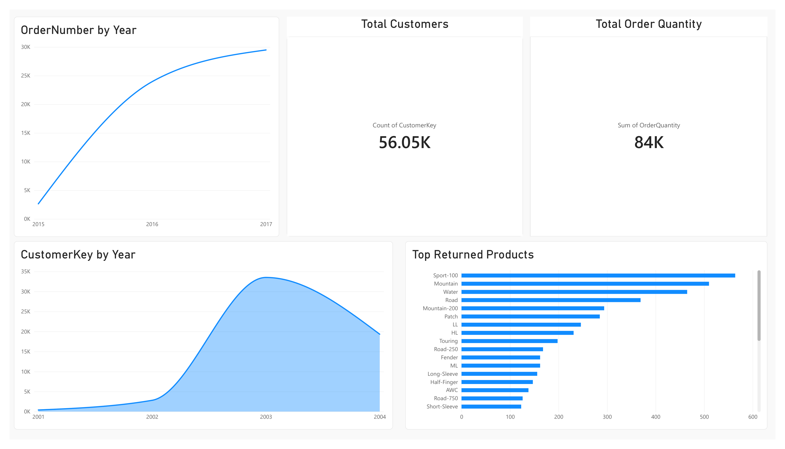

# Azure AdventureWorks End-to-End Data Engineering Project

An end-to-end Azure data engineering project built on the AdventureWorks dataset using **Azure Data Factory, Azure Data Lake Storage Gen2, Azure Databricks, PySpark, Azure Synapse Analytics, and Power BI**.

The project demonstrates a **metadata-driven ingestion pipeline**, Bronze/Silver/Gold-style data architecture, PySpark transformations, Synapse Serverless SQL serving objects, and a Power BI analytics layer.

---

## Architecture



### Pipeline Flow

```text
ADLS parameters/git.json
        ↓
LookupGit
        ↓
ForEachGit
        ↓
DynamicCopy  ← AdventureWorks CSV files from GitHub
        ↓
ADLS Gen2 Bronze
        ↓
Azure Databricks / PySpark
        ↓
ADLS Gen2 Silver (Parquet)
        ↓
Azure Synapse Serverless SQL
        ↓
Gold views + external sales table
        ↓
Power BI
```

---

## Project Highlights

- Built a **metadata-driven Azure Data Factory ingestion pipeline** using `Lookup`, `ForEach`, parameterized datasets, and a dynamic `Copy` activity.
- Used `git.json` to define source relative URLs, sink folders, and sink filenames for multiple AdventureWorks datasets.
- Stored raw source files in an **ADLS Gen2 Bronze layer**.
- Used **Azure Databricks + PySpark** to transform Bronze CSV data and write processed data to the **Silver layer as Parquet**.
- Queried Silver Parquet files through **Azure Synapse Serverless SQL** using `OPENROWSET`.
- Created a **Gold schema**, SQL views, external data sources, an external Parquet file format, and an external sales table.
- Connected the Synapse serving layer to **Power BI** for reporting and analytics.

---

## Technology Stack

| Layer | Technology |
|---|---|
| Source | GitHub, AdventureWorks CSV |
| Orchestration | Azure Data Factory |
| Data Lake | Azure Data Lake Storage Gen2 |
| Transformation | Azure Databricks, Apache Spark, PySpark |
| Storage Formats | CSV, Parquet |
| Serving | Azure Synapse Analytics Serverless SQL |
| SQL | T-SQL, `OPENROWSET`, views, external tables |
| Visualization | Power BI |
| Authentication | Managed Identity, OAuth 2.0 / Service Principal concepts |

---

## 1. Azure Data Factory — Metadata-Driven Ingestion

The repository includes `config/git.json`, while the working Azure pipeline reads its runtime copy from the ADLS Gen2 **`parameters` container**.

Each metadata entry contains:

```json
{
  "p_rel_url": "source-relative-path",
  "p_sink_folder": "destination-folder",
  "p_sink_file": "destination-file.csv"
}
```

ADF uses that metadata through:

```text
LookupGit → ForEachGit → DynamicCopy
```

One reusable Copy activity can therefore ingest multiple files instead of requiring a separate Copy activity for every dataset.

### Dynamic ADF Pipeline



The metadata covers:

- Product Categories
- Calendar
- Customers
- Product Subcategories
- Products
- Returns
- Sales 2015
- Sales 2016
- Sales 2017
- Territories

---

## 2. ADLS Gen2 — Bronze Layer

The Bronze layer stores the source CSV files before transformation.

```text
bronze/
├── AdventureWorks_Calendar/
├── AdventureWorks_Customers/
├── AdventureWorks_Product_Categories/
├── AdventureWorks_Products/
├── AdventureWorks_Returns/
├── AdventureWorks_Sales_2015/
├── AdventureWorks_Sales_2016/
├── AdventureWorks_Sales_2017/
├── AdventureWorks_Territories/
└── Product_Subcategories/
```

---

## 3. Azure Databricks + PySpark — Silver Layer

The Databricks notebook reads Bronze data from ADLS Gen2 through `abfss://` paths and transforms it with the PySpark DataFrame API.

The notebook works with:

- Calendar
- Customers
- Product Categories
- Products
- Returns
- Sales
- Territories
- Product Subcategories

The three annual Sales folders are read together using a wildcard path.

### PySpark Techniques Used

- `withColumn`
- `concat_ws`
- `split`
- `month`
- `year`
- `to_timestamp`
- `regexp_replace`
- `groupBy`
- `agg`
- `count`
- derived columns
- data type transformations
- CSV → Parquet processing

The transformed datasets are written to the **Silver layer as Parquet files**.

### Notebook

[`databricks/silver_layer.ipynb`](databricks/silver_layer.ipynb)

The public notebook uses Databricks Secret Scope references rather than hard-coded credentials.

---

## 4. Azure Synapse Analytics — Serving Layer

Azure Synapse Analytics uses the **Built-in Serverless SQL Pool** to expose Silver Parquet data for analytics.

The SQL implementation includes:

- `gold` schema
- database-scoped credential using Managed Identity
- Silver and Gold external data sources
- Parquet external file format
- Gold SQL views
- external sales table
- validation queries

### Gold Views

```text
gold.calendar
gold.customers
gold.products
gold.returns
gold.sales
gold.subcat
gold.territories
```

Most Gold objects are logical views over Silver Parquet files using `OPENROWSET`.

Example:

```sql
CREATE OR ALTER VIEW gold.products
AS
SELECT *
FROM OPENROWSET(
    BULK 'https://awstoragedatalakemp.dfs.core.windows.net/silver/AdventureWorks_Products/',
    FORMAT = 'PARQUET'
) AS Q;
GO
```

The project also creates:

```text
gold.extsales
```

as an external table backed by the Gold storage location.

### Synapse Gold View



---

## 5. Power BI Dashboard

Power BI connects to the Synapse serving layer for reporting.

The dashboard includes:

- Order count by year
- Customer record count
- Customer records by year
- Total order quantity
- Top returned products

### Dashboard Preview



Files:

- [`AdventureWorks_Azure_Dashboard.pbix`](powerbi/AdventureWorks_Azure_Dashboard.pbix)
- [`dashboard_preview.pdf`](powerbi/dashboard_preview.pdf)

---

## Repository Structure

```text
azure-adventureworks-data-engineering/
│
├── README.md
├── .gitignore
│
├── architecture/
│   └── azure_data_engineering_architecture.png
│
├── adf/
│   ├── arm-template/
│   └── screenshots/
│       ├── adf-dynamic-pipeline.png
│       └── adf-static-pipeline.png
│
├── config/
│   └── git.json
│
├── databricks/
│   └── silver_layer.ipynb
│
├── synapse/
│   ├── sql/
│   │   ├── 01_create_gold_schema.sql
│   │   ├── 02_create_external_resources.sql
│   │   ├── 03_create_gold_views.sql
│   │   ├── 04_create_external_sales_table.sql
│   │   └── 05_validation_queries.sql
│   └── screenshots/
│       └── synapse-gold-view.png
│
└── powerbi/
    ├── AdventureWorks_Azure_Dashboard.pbix
    ├── dashboard_preview.pdf
    └── dashboard_preview.png
```

---

## How to Reproduce

1. Create an Azure resource group and ADLS Gen2 storage account.
2. Create `bronze`, `silver`, `gold`, and `parameters` containers.
3. Create or deploy the Azure Data Factory pipeline.
4. Upload `config/git.json` to the ADLS `parameters` container.
5. Run the ADF dynamic ingestion pipeline to populate Bronze.
6. Create an Azure Databricks workspace and configure secure ADLS authentication.
7. Run `databricks/silver_layer.ipynb` to produce Silver Parquet data.
8. Create an Azure Synapse workspace.
9. Run the SQL scripts in `synapse/sql/` in numerical order.
10. Connect Power BI to the Synapse Serverless SQL endpoint and open/refresh the PBIX report.

---

## Security

This public repository intentionally excludes Azure credentials and secrets.

Do not commit:

- client secrets
- SAS tokens
- storage account keys
- passwords
- private connection strings

The Databricks notebook uses Secret Scope references, while the Synapse configuration uses Managed Identity.

---

## Skills Demonstrated

`Azure Data Factory` · `ADLS Gen2` · `Azure Databricks` · `Apache Spark` · `PySpark` · `Azure Synapse Analytics` · `Serverless SQL` · `T-SQL` · `OPENROWSET` · `Parquet` · `Power BI` · `Metadata-Driven Pipelines` · `ETL/ELT` · `Managed Identity`

---

## Acknowledgment

This project was built as a hands-on implementation of an Azure end-to-end data engineering architecture using the AdventureWorks dataset. The Azure environment, pipeline deployment, transformation workflow, serving layer, Power BI report, repository organization, documentation, and security cleanup were completed as part of this implementation.

---

## Author

**Malay Patel**  
Computer Science Co-op Student  
Wilfrid Laurier University
